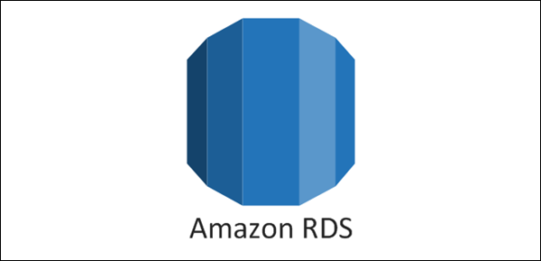

# Terraform_AWS_Three_Tier_Architecture
 
A three-tier architecture typically consists of a presentation tier, application tier, and data tier. Terraform modules can be used to create reusable and repeatable infrastructure-as-code for each tier, and the architecture can be placed within a custom VPC for added security and isolation.

  

  

  

This project aims to establish a three-level architecture utilizing Terraform modules to simplify the process of creating repeatable and reusable infrastructure. 
  
The architecture will be placed within a custom Virtual Private Cloud (VPC) for enhanced security and isolation. 
  
The web tier will feature a bastion host and NAT gateway in public subnets to provide access to the underlying infrastructure and allow private subnets to access internet updates. 
  
In the application tier, an internet-facing load balancer will direct internet traffic to an auto-scaling group in private subnets, along with an auto-scaling group for the backend application. The desired capacity for auto-scaling is set up for 2 EC2 instances, with a minimum of 1 and maximum of 3 units. Scripts will be used to install Apache web server on the frontend and Node.js on the backend. 
  
An additional layer of private subnets in the database tier will host a Multi-zone RDS MySQL database cluster which will be accessed using Node.js. This is just an example of the infrastructure that can be used for a web application. We will be using Cloud9 as Integrated Development Environment (IDE), but other options such as VS Code can also be used.

  
  

  

  

Amazon RDS is a RDBMS designed for users who want to set up, operate and scale databases in the cloud. The solution allows users to launch database instances and connect applications.
  
Amazon RDS has a Multi-AZ DB cluster deployment option. It is a high availability deployment mode of Amazon RDS with two readable standby DB instances. A Multi-AZ DB cluster has a writer DB instance and two reader DB instances in three separate Availability Zones in the same AWS Region. Multi-AZ DB clusters provide high availability, increased capacity for read workloads, and lower write latency when compared to Multi-AZ DB instance deployments.
  
Pros
 
- Support. Amazon RDS supports various database systems, such as MySQL, Postgres, MariaDB, Oracle, Microsoft SQL, and hybrid Aurora (which supports both MySQL and PostgreSQL). 
- Automation. Amazon RDS supports automatic host replacement, automatic software patches, auto-backup, and scheduled snapshots. These features help recover data lost due to corruption or accidental deletion. 
- Security. The DBMS features network isolation, data at rest encryption and in transit encryption, and resource-level permissions to ensure the highest level of data security.
  

Cons
 
- No direct access. Amazon RDS is limited in providing direct access to the OS or the hardware. No direct access means that performance tuning must be done within the application or by tweaking the database engine parameters. 
- Additional metrics cost. RDS comes with basic logging, but users must pay a premium to get detailed logs (featuring fine-grained logging displaying events per minute).  

Pricing
 
 

  

  

  

  

  

  

  

  

